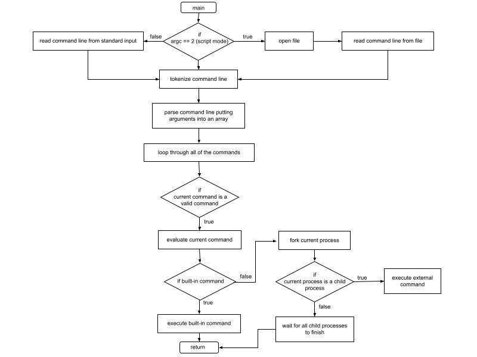

# Shell Emulator


<!-- TABLE OF CONTENTS -->
<details>
  <summary>Table of Contents</summary>
  <ol>
    <li>
      <a href="#about-the-project">About The Project</a>
    </li>
    <li><a href="#structure">Structure</a></li>
    <li><a href="#execution">Execution</a></li>
    <li><a href="#learning-challenges">Learning Challenges</a></li>
    <li><a href="#contact">Contact</a></li>
  </ol>
</details>


<!-- ABOUT THE PROJECT -->
## About The Project

A simple Unix shell that reads input from user, evaulates the input, and prints out the requested output.

* Waits for input from user through text based interface, processes this input, and takes appropriate actions
* Can run built-in and external commands using fork-exec system calls
* Implemented reading from a script and executing commands in that file
* Capable of redirecting output to files
* Able to run concurrent commands with '&' 


<!-- STRUCTURE -->
## Structure

The Shell code is either interacted with through the terminal as a text interface or by executing a script file.
Each command given is represented as a `struct Command` that is then used to take action to execute command in the correct manner that is created in `parse_command()`.

```
 struct Command {
  char *name;       /* command name */
  char **args;      /* Argument array for the command, 
                    includes all input that was recieved from the command line
                    args[0] is the command name of the first command call */
  char *outputFile; /* Redirect target for file (NULL means no redirect, 
                    "ERROR" means invalid redirection) */
  int num_args;     /* the number of arguments in the command. */
};
 ```

Based on the command given, the following built-in commands may be executed:
* `cd`
* `path`
* `exit`

Or an external command may be executed by fork-and-exec and redirection if requested.

<!-- EXECUTION -->
## Execution

The basis of the shell is the read-evaluate-print loop in `main()` in `utcsh.c`:
1. Reads input from the user or from a script that is provided
2. Evaluates the input, and executes the appropriate action based on the users request
3. Prints any output that is associated with the requested action to either the terminal or redirected to a file

Overall Execution of Shell Emulator in `utcsh.c`




<!-- LEARNING CHALLENGES -->
## Learning Challenges

The major problems that were encountered while programming/designing include:

* detecting if a path is an absolute path or a relative path
* checking for errors within a given command line
* running concurrent commands 

How these problems were solved:

* keeping track of all the shell paths in an array that have been previously used and checking with this array whether the current path is contained in this array
* having multiple error checks when an invalid command line is given to account for many different cases and variations of incorrect format of the command line
* using fork and wait inorder that multiple process can be running but they must all wait for all other processes to complete before moving on

<!-- CONTACT -->
## Contact

Lucy Mahlmann - lmahlmann@utexas.edu

Reyva Chawla - reyvachawla@utexas.edu

Project Link: [https://github.com/lucy-mahlmann/Shell-Emulator](https://github.com/lucy-mahlmann/Shell-Emulator)

<p align="right">(<a href="#readme-top">back to top</a>)</p>

